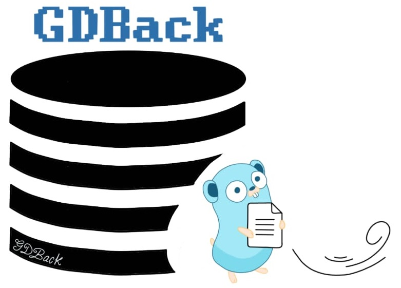

<p align="center">
  
</p>

# Description
GDBack is a tool developed in Golang to extract relevant information about the system. This information can be useful when performing an investigation on a computer. The collected information is stored in a sqlite file.
+ Features
 - Extracts all files from a disk or from a specific path with different parameters: their name, path, MD5 hash, size, modification and creation dates.
# Usage
### Windows
Download the executable file and run it as administrator, right click with the mouse and then Run as administrator.

# Build
### Dependency
```
go get github.com/AlecAivazis/survey
go get github.com/briandowns/spinner
go get github.com/gosuri/uiprogress
```
### Windows
```
go env -w GO111MODULE=off
$Env:CGO_ENABLED = 1
```
